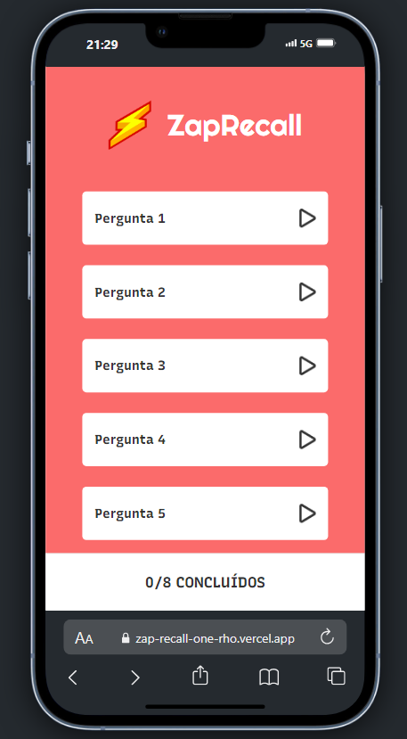
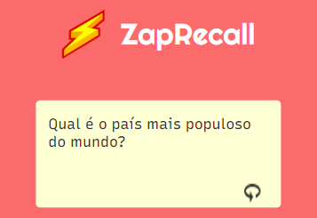
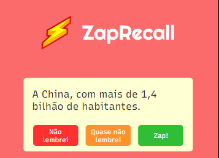

# Zap Recall

Este é o **Zap Recall**, um projeto de quiz interativo inspirado em cartões de memorização. Desenvolvido com **React** e **Styled Components**, este aplicativo permite que os usuários revisem perguntas, virem os cartões e escolham opções de resposta, marcando o progresso à medida que avançam.

## 🚀 Deploy
O projeto está no ar através do [Vercel](https://zap-recall-one-rho.vercel.app/), clique para acessar!

## 🖼️ Demonstração

### Página Inicial


### Interação com as Perguntas
Ao clicar no ícone de play, o cartão se vira e exibe uma pergunta, junto com três opções de resposta:



### Respostas
Dependendo da escolha do usuário, o ícone muda para o status correspondente:
- **Vermelho**: Não lembrei.
- **Laranja**: Quase não lembrei.
- **Verde**: Lembrei!



## 🛠️ Tecnologias Utilizadas

- **React**: Biblioteca JavaScript para construção de interfaces.
- **Styled Components**: Para estilização dos componentes.
- **Vite**: Ferramenta para otimização do desenvolvimento.
- **Vercel**: Plataforma de deploy para frontends.

## 📚 Como Rodar Localmente

1. Clone este repositório:

```bash
git clone https://github.com/seu-usuario/zap-recall.git

2. Instale as dependências:
bash
npm install

3. Execute o servidor local:
bash
npm run dev

4. Acesse o aplicativo no navegador:
http://localhost:3000


